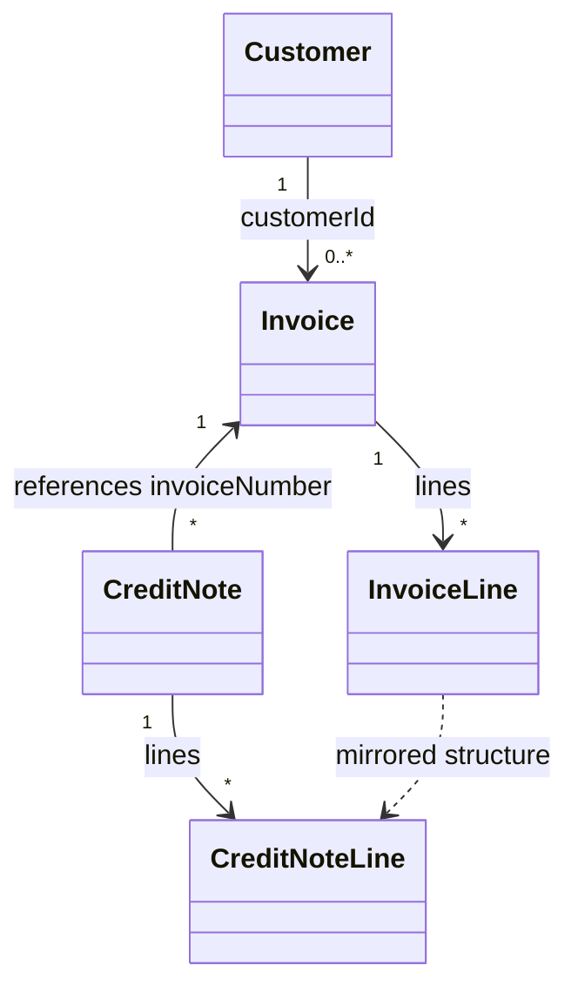

# Design Document — Credit Note Issuance

## Overview

This feature adds credit note issuance to the EMG billing service. A credit note
partially or fully reverses an existing invoice, producing negative monetary
amounts that offset the original charges. It extends the existing Java 21 /
Spring Boot service without changing the core invoice flow; the primary
modifications are:

1. **Retrofit `InvoiceController`** to persist each created invoice into a new
   `InvoiceStore` so credit notes can look up originals.
2. **Introduce `CreditNoteCalculator`** that mirrors the `InvoiceCalculator`
   pipeline (net → discount → VAT → total) but operates on credited lines only
   and negates every monetary result.
3. **Introduce `CreditNoteService`** that orchestrates validation, calculation,
   sequence number assignment and persistence.
4. **Introduce `CreditNoteController`** that exposes two REST endpoints:
   `POST /api/credit-notes/{invoiceNumber}` and
   `GET /api/credit-notes/{creditNoteNumber}`.
5. **Extend `BillingExceptionHandler`** with handlers for all new exception types.

All amounts stay in EUR. Rounding follows the existing HALF_UP at-each-step
convention mandated by `docs/billing-rules.md` and enforced by
`InvoiceCalculator`.

---

## Architecture

```mermaid
flowchart TD
    subgraph REST Layer
        IC[InvoiceController\nPOST /api/invoices/{customerId}]
        CNC[CreditNoteController\nPOST /api/credit-notes/{invoiceNumber}\nGET  /api/credit-notes/{creditNoteNumber}]
    end

    subgraph Application Layer
        CS[CustomerService]
        CALC[InvoiceCalculator]
        CNS[CreditNoteService]
        CNCALC[CreditNoteCalculator]
    end

    subgraph Storage Layer
        IS[InvoiceStore\nin-memory map\nINV-XXXXX → Invoice]
        CNStore[CreditNoteStore\nin-memory map\nCN-XXXXX → CreditNote\nsequence counter\nreversal tracker]
        CR[CustomerRepository]
    end

    subgraph Exception Handling
        BEH[BillingExceptionHandler\n@RestControllerAdvice]
    end

    IC -->|calculate| CALC
    IC -->|persist| IS
    IC --> CS

    CNC -->|createCreditNote / getCreditNote| CNS
    CNS -->|lookup invoice| IS
    CNS -->|calculate| CNCALC
    CNS -->|persist / lookup| CNStore
    CS --> CR
    CNCALC --> VRP[VatRateProvider]
```

The storage layer is intentionally in-memory (matching the existing
`CustomerRepository` pattern) so no external database dependency is introduced.

---

## Components and Interfaces

### InvoiceStore

New `@Repository` class. Wraps a `ConcurrentHashMap<String, Invoice>`.

```java
public interface InvoiceStore {
    void save(Invoice invoice);
    Invoice findByNumber(String invoiceNumber);   // throws InvoiceNotFoundException
}
```

`InvoiceController` is modified to inject `InvoiceStore` and call `save()` after
every successful `calculate()` call, before returning the response. The sequence
counter (`AtomicInteger`) stays in `InvoiceController`.

### CreditNoteStore

New `@Repository` class. Manages:

- `ConcurrentHashMap<String, CreditNote>` — keyed by credit note number.
- `AtomicInteger sequenceCounter` — seed 1, formatted as `CN-%05d`.
- `ConcurrentHashMap<String, List<CreditNote>>` — invoice number → list of issued
  credit notes, used to compute remaining reversible amounts and to detect full
  reversals.

```java
public interface CreditNoteStore {
    CreditNote save(CreditNote creditNote);
    CreditNote findByNumber(String creditNoteNumber);  // throws CreditNoteNotFoundException
    List<CreditNote> findByInvoiceNumber(String invoiceNumber);
    String nextCreditNoteNumber();
    BigDecimal remainingReversibleAmount(String invoiceNumber, BigDecimal originalTotal);
    boolean isFullyReversed(String invoiceNumber);
}
```

### CreditNoteCalculator

New `@Service`. Mirrors `InvoiceCalculator` exactly but:
- Accepts `List<CreditNoteLine>` (credited lines with credited quantity).
- Negates every monetary result before returning.
- Always recalculates from scratch — never reuses the original invoice's
  already-rounded amounts.

```java
public CreditNote calculate(
        String creditNoteNumber,
        String invoiceNumber,
        String customerId,
        String countryCode,
        CustomerTier tier,
        List<CreditNoteLine> lines);
```

Calculation pipeline (identical order to `InvoiceCalculator`):

```
net          = Σ (unitPrice × creditedQty)          [HALF_UP, 2dp]
discount     = net × discountRate                    [HALF_UP, 2dp]
taxable      = net − discount
vat          = taxable × vatRate                     [DOWN,    2dp]  ← matches InvoiceCalculator
total        = taxable + vat
```

All five monetary fields are then negated and re-scaled to 2 dp (negation of a
scaled `BigDecimal` needs no additional rounding).

> **Design decision — VAT rounding mode**: `InvoiceCalculator` uses
> `RoundingMode.DOWN` for VAT (not HALF_UP). The billing-rules.md says HALF_UP
> "at each step", but the existing implementation deviates for the VAT step.
> `CreditNoteCalculator` mirrors this behaviour exactly so that a full credit
> note always produces the arithmetic negation of the original invoice amounts
> (Requirement 7).

### CreditNoteService

New `@Service`. Orchestrates the full creation flow:

```
1. Look up Invoice by invoiceNumber          → InvoiceNotFoundException if missing
2. Check isFullyReversed                     → AlreadyFullyReversedException if true
3. Validate CreditNoteRequest lines
   a. Full reversal (no lines specified): use all original lines at original qty
   b. Partial reversal: validate each requested line reference exists → 400
                        validate qty ≥ 1                              → 400
                        validate qty ≤ remaining reversible qty       → ExcessiveReversalException (400)
4. Build List<CreditNoteLine>
5. Call CreditNoteCalculator.calculate(...)
6. Assign credit note number via CreditNoteStore.nextCreditNoteNumber()
7. Persist via CreditNoteStore.save(creditNote)
8. Return persisted CreditNote
```

### CreditNoteController

New `@RestController` at `/api/credit-notes`.

| Method | Path | Description |
|--------|------|-------------|
| POST   | `/api/credit-notes/{invoiceNumber}` | Issue a credit note |
| GET    | `/api/credit-notes/{creditNoteNumber}` | Retrieve a credit note |

The POST body is a `CreditNoteRequest` record. When the request body is absent
or has no lines *and* `fullReversal` is false, a `400` is returned. When
`fullReversal` is true, the body lines are ignored and all original lines are
credited.

Validation of the `creditNoteNumber` path variable format (non-empty, 1–50
alphanumeric characters) is done with a Bean Validation constraint on the
controller method parameter, handled by `BillingExceptionHandler`.

### Exception Types

| Exception class | HTTP status | Error code | Condition |
|---|---|---|---|
| `InvoiceNotFoundException` | 404 | 4041 | Invoice number not found |
| `CreditNoteNotFoundException` | 404 | 4042 | Credit note number not found |
| `AlreadyFullyReversedException` | 409 | 4091 | Invoice already fully reversed |
| `ExcessiveReversalException` | 400 | 4001 | Credited qty exceeds reversible qty |
| `InvalidCreditNoteRequestException` | 400 | 4002 | Malformed request (empty body, bad qty, bad reference, etc.) |

All extend `RuntimeException`. `BillingExceptionHandler` gains one
`@ExceptionHandler` method per new type, plus a handler for
`ConstraintViolationException` for path-variable validation failures, all
returning the standard `{ "error": string, "code": number }` payload with
messages ≤ 500 characters. No partial state changes are persisted on any error
path — all validation runs before any `save()` call.

---

## Data Models

### CreditNoteLine

Mirrors `InvoiceLine`. Carries the credited quantity (may differ from original).

```java
package com.emg.billing.model;

import java.math.BigDecimal;

public record CreditNoteLine(
        String reference,
        String description,
        int creditedQuantity,
        BigDecimal unitPrice) {

    /** Credited line total (positive; negation applied at CreditNote level). */
    public BigDecimal netAmount() {
        return unitPrice.multiply(BigDecimal.valueOf(creditedQuantity));
    }
}
```

### CreditNote

```java
package com.emg.billing.model;

import java.math.BigDecimal;
import java.time.LocalDate;
import java.util.List;

public record CreditNote(
        String creditNoteNumber,
        String invoiceNumber,
        String customerId,
        LocalDate issueDate,
        List<CreditNoteLine> lines,
        BigDecimal netAmount,          // negative
        BigDecimal discountAmount,     // negative (or zero)
        BigDecimal vatAmount,          // negative
        BigDecimal totalAmount) {      // negative
}
```

### CreditNoteRequest

Sent as the POST body. `fullReversal = true` ignores `lines`.

```java
package com.emg.billing;

import java.util.List;

public record CreditNoteRequest(
        boolean fullReversal,
        List<CreditNoteLineRequest> lines) {

    public record CreditNoteLineRequest(
            String reference,
            int quantity) {
    }
}
```

### Relationship diagram



---

## Correctness Properties

*A property is a characteristic or behavior that should hold true across all valid executions of a system — essentially, a formal statement about what the system should do. Properties serve as the bridge between human-readable specifications and machine-verifiable correctness guarantees.*

### Property 1: Full credit note negates every monetary field

*For any* valid invoice (any customer tier, any country, any non-empty line list), issuing a full credit note against it shall produce a credit note whose `netAmount`, `discountAmount`, `vatAmount`, and `totalAmount` are each the exact arithmetic negation of the corresponding invoice field (i.e., their sum equals 0.00 for each field).

**Validates: Requirements 7.1, 7.2, 7.3, 7.4**\n### Property 2: Zero-total invoice full reversal yields zero credit note

*For any* invoice whose computed total is exactly 0.00, issuing a full credit note shall produce a credit note with `totalAmount = 0.00`, and the sum of both totals shall equal exactly 0.00.

**Validates: Requirement 7.5**\n### Property 3: Remaining reversible amount is non-negative and decreases monotonically

*For any* invoice and any sequence of valid partial credit notes issued against it, the remaining reversible amount after each issuance shall be ≥ 0.00, and shall be strictly less than the remaining reversible amount before that issuance (unless the credited total of the partial note is zero, which is rejected by validation).

**Validates: Requirement 7.6**\n### Property 4: Partial credit note amounts are computed from scratch

*For any* invoice and any subset of its lines with valid credited quantities, the credit note amounts computed by `CreditNoteCalculator` shall equal the result of running the full invoice calculation pipeline (net → discount → VAT → total) on *only* those credited lines and quantities, negated — and shall not equal any amount derived by scaling the original invoice's already-rounded amounts by a quantity fraction.

**Validates: Requirements 2.7, 3.7**\n### Property 5: Credit note number uniqueness

*For any* sequence of credit note creation requests, no two persisted credit notes shall share the same credit note number, and every credit note number shall match the format `CN-XXXXX` where `XXXXX` is a zero-padded five-digit integer ≥ 1.

**Validates: Requirement 2.8**\n### Property 6: Whitespace/invalid line quantities are always rejected

*For any* partial credit note request containing a line with quantity < 1, the system shall reject the request with a 400 response and leave all stored state unchanged.

**Validates: Requirement 3.5**

---

## Error Handling

All errors follow the existing contract `{ "error": string, "code": number }`.

| Scenario | Status | `code` | Notes |
|---|---|---|---|
| Invoice not found | 404 | 4041 | From `InvoiceNotFoundException` |
| Credit note not found | 404 | 4042 | From `CreditNoteNotFoundException` |
| Invoice already fully reversed | 409 | 4091 | From `AlreadyFullyReversedException` |
| Credited qty exceeds reversible | 400 | 4001 | From `ExcessiveReversalException`; message names the offending line reference |
| Invalid request (empty body, bad ref, qty < 1, qty range) | 400 | 4002 | From `InvalidCreditNoteRequestException` |
| Bean validation failure (path var format) | 400 | 4002 | From `ConstraintViolationException` |

**No-partial-state guarantee**: `CreditNoteService` validates all lines before
calling `CreditNoteCalculator` and before calling any `save()` method. If any
validation step fails an exception is thrown immediately; no partial writes
occur.

**Message length**: `BillingExceptionHandler` truncates all messages to 500
characters before returning them, as required by Requirement 5.4.

---

## Testing Strategy

### Unit tests (example-based)

- `CreditNoteCalculatorTest` — mirrors `InvoiceCalculatorTest`:
  - Correct net/discount/VAT/total for each tier (STANDARD, SILVER, GOLD).
  - All amounts are negative.
  - Partial credit uses only credited lines/quantities.
  - Rounding edge cases (e.g., quantities/prices that produce non-terminating decimals).
- `CreditNoteStoreTest`:
  - Sequential numbering starts at `CN-00001`.
  - `remainingReversibleAmount` decreases correctly after each partial note.
  - `isFullyReversed` returns true only when sum of absolute credit note totals equals invoice total.
- `CreditNoteServiceTest`:
  - 404 when invoice not found.
  - 409 when invoice already fully reversed.
  - 400 when line reference not found in original.
  - 400 when qty < 1 or qty > original line qty.
  - 400 when partial request has no lines.
- `CreditNoteControllerTest` (Spring MockMvc):
  - Happy-path POST returns 200 with correct body.
  - Happy-path GET returns stored credit note.
  - 400 for malformed `creditNoteNumber` (path var format).
  - All error codes from the table above are exercised.

### Property-based tests

The project uses JUnit 5 (from `spring-boot-starter-test`). The property-based
testing library chosen is **[jqwik](https://jqwik.net/)**, which integrates
natively with JUnit 5 — no separate test runner is needed.

Add to `pom.xml`:
```xml
<dependency>
    <groupId>net.jqwik</groupId>
    <artifactId>jqwik</artifactId>
    <version>1.8.4</version>
    <scope>test</scope>
</dependency>
```

Each `@Property` method is configured with `tries = 100` (jqwik default is 1000;
100 is the required minimum per this spec).

#### PBT class: `CreditNoteRoundTripTest`

Tests are tagged via jqwik's `@Label` annotation:

| Test method | Property | Tag |
|---|---|---|
| `fullReversalNegatesEveryField` | Property 1 | `Feature: credit-note-issuance, Property 1: full credit note negates every monetary field` |
| `zeroTotalInvoiceFullReversal` | Property 2 | `Feature: credit-note-issuance, Property 2: zero-total invoice full reversal yields zero credit note` |
| `remainingReversibleAmountIsNonNegative` | Property 3 | `Feature: credit-note-issuance, Property 3: remaining reversible amount is non-negative and decreases monotonically` |
| `partialCreditComputedFromScratch` | Property 4 | `Feature: credit-note-issuance, Property 4: partial credit note amounts are computed from scratch` |
| `creditNoteNumbersAreUnique` | Property 5 | `Feature: credit-note-issuance, Property 5: credit note number uniqueness` |
| `quantityBelowOneIsAlwaysRejected` | Property 6 | `Feature: credit-note-issuance, Property 6: whitespace/invalid line quantities are always rejected` |

**Generator strategy**:
- Arbitrary invoice lines: `reference` is a short alphanumeric string, `quantity`
  is 1–99, `unitPrice` is a `BigDecimal` in [0.01, 9999.99] with 2 decimal places.
- Customer tier is drawn from `Arbitraries.of(CustomerTier.values())`.
- Country code is drawn from the known VAT rate map (`FR`, `BE`, `DE`, `MA`, `IN`).
- For Property 3, a sequence of 1–5 partial reversal requests is generated, each
  consuming a random but valid subset of remaining quantities.
- All tests run purely in memory against `CreditNoteCalculator` and
  `CreditNoteStore`; no Spring context is started for PBT tests (plain unit
  construction).
